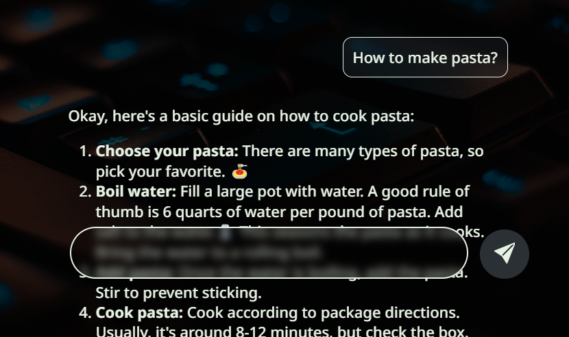
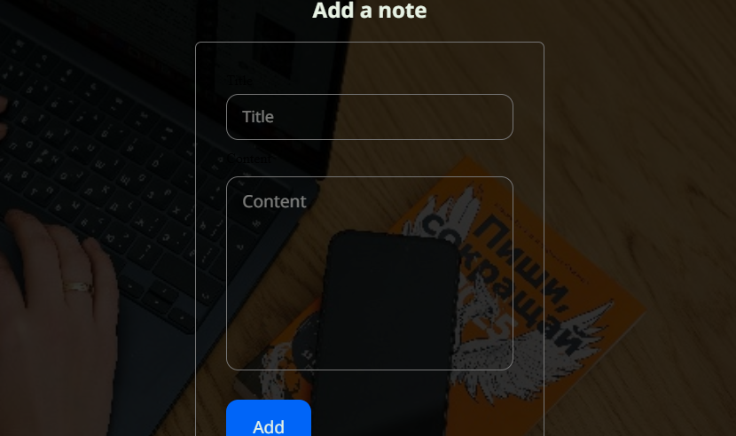
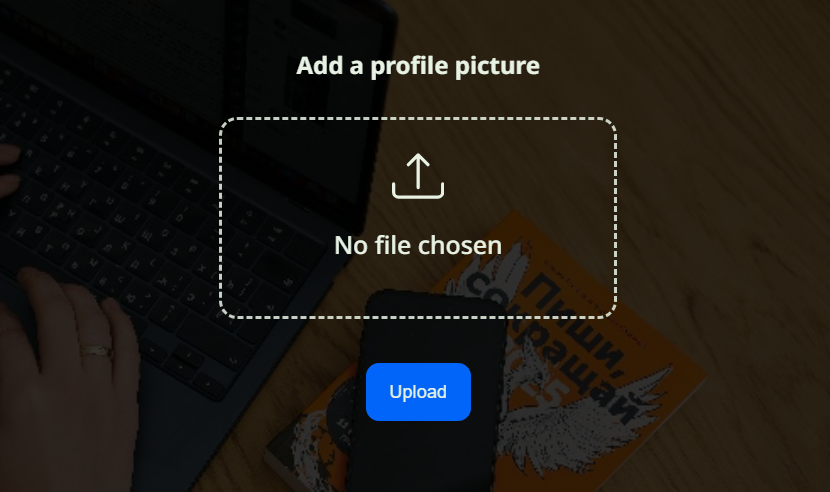

# Portolio Web Application (FolaDevelops)  

A full-stack portfolio web application demonstrating AI apps, authentication systems, e-commerce apps, note-taking apps, picture upload apps and deployment pipelines.  

This project serves as a showcase of my backend and frontend engineering skills, as well as my ability to deploy production-ready systems.  


🔗 **Live Demo:** [foladevelops.onrender.com](https://foladevelops.onrender.com)

---

## 🚀 Features  

- **AI App**  
  - Multi-chat sessions with context awareness per topic.  
  - User-specific chat histories with secure storage.  
  - Extensible framework for domain-specific tasks (e.g., shopping help, customer support). 

- **Authentication System**  
  - Sign-up, login, logout with secure session handling.  
  - Email verification and password reset via one-time codes.  
  - Role-based access (admin vs. user).  

- **E-Commerce Module**  
  - Product listing and order workflow.  
  - Responsive, user-friendly design.  
  - Automated confirmation emails for successful orders. 

- **Note-Taking App**  
  - Create, edit, and delete notes with a clean interface. 
  - User-specific storage.  
  - Responsive design for mobile and desktop. 

- **Picture Upload App**  
  - Profile picture management with secure uploads. 
  - Cloud-based image storage and retrieval.  
  - Images optimized for fast loading. 

- **Deployment & Hosting**  
  - VPS hosting with Nginx, Gunicorn, and PostgreSQL.  
  - SSL security via Let’s Encrypt.  
  - Static file handling through Nginx.  

- **Email Automation**  
  - SMTP integration for account verification, password resets, and order confirmations.  

---

## 🛠️ Tech Stack  

- **Backend:** Python, Flask, SQLAlchemy  
- **Frontend:** HTML, CSS, JavaScript, Jinja templates  
- **Database:** PostgreSQL  
- **Deployment:** VPS (Hostinger), Nginx, Gunicorn, Let’s Encrypt SSL  
- **Email:** SMTP (custom domain)  
- **Version Control:** Git, GitHub  

---


## 🖥️ Preview
### 🤖 AI App
 
### 🔑 Login Page
 
<br><br>
### 🛍️ Product Listing

<br><br>
### 📝 Note-Taking App
 
<br><br>
### 🖼️ Picture Upload App
 

---

## 📂 Project Structure  

    fola-develops/
    │── main.py              # Flask app entry point
    │── supplements/         # Supporting modules
    │ │── entities.py        # Database entities
    │ │── forms.py           # CSRF protected WTForms 
    │ │── ai_skeleton.py     # AI system settings
    │ │── items_data.py      # E-commerce demo items
    │ │── email_templates.py # Styled email templates
    │── templates/           # Jinja HTML templates
    │── static/              # CSS, JS, images
    └── requirements.txt     # Dependencies

---

## 🔧 Setup & Installation  

1. **Clone the repository**  
   ```bash
   git clone https://github.com/folaarr/fola-develops.git
   cd fola-develops

2. **Create a virtual environment**  
    ```bash
    python -m venv venv
    source venv/bin/activate  # On Linux/Mac
    venv\Scripts\activate     # On Windows

3. **Install dependencies**  
    ```bash
    pip install -r requirements.txt

4. **Set up environment variables** 
    ```bash
    export DATABASE-URI=your_postgres_or_sqlite_url
    export FLASK-SECRET-KEY=your_flask_secret_key
    export ADMIN-EMAIL=your_primary_email_for_admin_control
    export EMAIL=your_email_for_smtp
    export PASSWORD=your_password_for_smtp
    export GEMINI_API_KEY=your_gemini_api_key
    export CLOUDINARY_URL=your_cloudinary_cloud_storage_url
    export API-URL=your_green_api_url_for_automated_whatsapp_messages
    export ID-INSTANCE=your_green_api_id
    export API-TOKEN-INSTANCE=your_green_api_token
    export NUMBER=your_green_api_phone_number
    export VIDEO-URL=your_video_url

4. **Start the app** 
    ```bash
    python main.py
---
<!-- 
## 🌐 Deployment 

- Configured for VPS hosting with Nginx + Gunicorn.

- SSL certificates via Let’s Encrypt.

- PostgreSQL managed securely with environment variables.

- Static assets served directly through Nginx.

--- -->

## 📬 For Inquiries, Contact

- **Portfolio (Live Projects):** [foladevelops.onrender.com](https://foladevelops.onrender.com)  
- **GitHub:** [github.com/folajimiabolade](https://github.com/folajimiabolade)  
- **X:** [x.com/onlyonefola](https://x.com/onlyonefola)  
- **LinkedIn:** [linkedin.com/in/folajimi-abolade](https://www.linkedin.com/in/folajimi-abolade)  
- **Email:** folajimiabolade@gmail.com 
